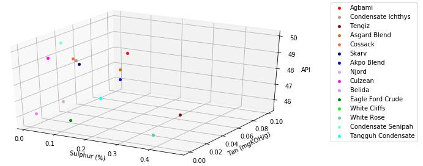
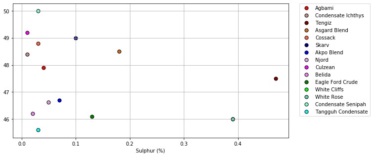
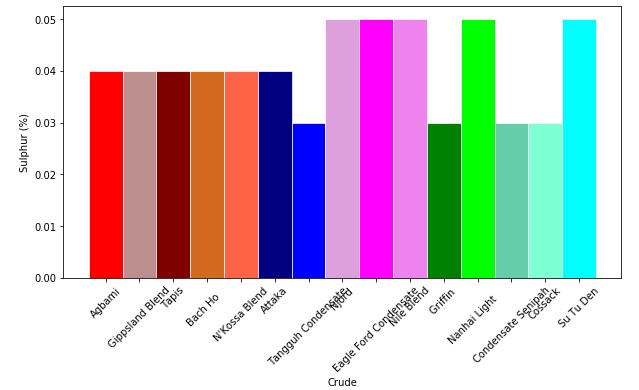

# Crudecompare Dashboard

## Table of contents
* [Overview and Project Motivation](#overview-and-project-motivation)
* [Files in the repository](#files-in-the-repository)
* [How to use](#how-to-use)
* [Licensing and Acknowledgements](#licensing-and-cknowledgements)

## Overview and Project Motivation

With this project I implemented a dashboard on a Jupyter Notebook to compare crude oil grades traded in the international market. 

During my professional career in the oil industry, I realized that a key success factor of the business is the correct market evaluation of the crude oil produced and sold. My motivation for this project and topic related with crude oil grades is a result of looking for a process that could help oil industry professionals to quickly find answers to questions similar to the following:

1. Given a certain crude oil grade, what is its best substitute?
2. What are the main differences between two crude oil benchmarks?
3. What are the 15 more expensive crude oil grades?

For this project, crude oil data is gathered from the websites of selected oil companies. After being treated, the resulting dataset, compiling more than 200 different crude oil assays, is saved on a csv file. The ***Crudecompare Dashboard*** will focus on three main parameters, API gravity, Sulphur content and Total Acidity Number. For the data modelling, the k-nearest algorithm is used for regression and assess the relative distance of a k number of crude oil grades compared with a grade used as reference.

More information about the topic is found [here](https://medium.com/@jeyenry/what-are-the-15-most-expensive-crude-oil-in-the-world-part-1-e830ce3a3767).

## Files in the repository

- README.md: this file, containing a overview of the project.
- crudecompare_dashboard-v004.ipynb: Jupyter Notebook containing the data processing and evaluations.
- /data/crude_assays/assays_summary/master_crude_20220916.csv: Cleaned dataset provided for the evaluations.

Inside the **data** folder, the **assays_summary** folder will be also used by the functions on the notebook to compile the data from the crude oil assay files. The other folders (bp, equinor, exxon and totalenergies), will be used to store the crude oil assay files downloaded from the corresponding oil companies' websites for further processing. 

## How to use

1. Clone the directory to your local machine.
2. Install the requirements for the following packages:
- Pandas
- Scikit-Learn
- Selenium
- BeautifulSoup
- A-world-of-countries

To use the ***Crudecompare Dashboard***, follow the instructions and descriptions on the *crudecompare_dashboard-v004.ipynb* file. 

The file is organized in two main sections, as detailed in the descriptions. The first section is related with the data gathering and preparation and on the second part is presented the evaluation and assessment of three business questions. 

The evaluation results will be shown based on a table with the grades ranked by proximity to the reference grade. In addition, the ranking is also displayed on a chart. Depending on the number of quality parameters selected, the chart dimension will be 3d, 2d or 1d.

## Results of the Analysis
Substitute grades can be effectively assessed and easily found based on the parameters, API, Tan and Sulphur content. Those parameters can also help to differentiate the evaluation of the main crude oil benchmarks. The results can be displayed in 3D, 2D or 1D, depending on the number of parameters used for the evaluation. For example, the charts below show the results obtained when comparing potential substitute grades for Agbami based on selected number of parameters for reference.

## Licensing and Acknowledgements

This project is an assignment for the Data Science Nanodegree course of Udacity.

- Author: Jorge Assis
- Data Source credit: BP, EQUINOR, EXXON, TOTALENERGIES.
- License: MIT License
- Disclaimer: The used crude oil data sheets are for information purposes only. No guaranty is given as to its accuracy or as to any consequences arising from its use.

